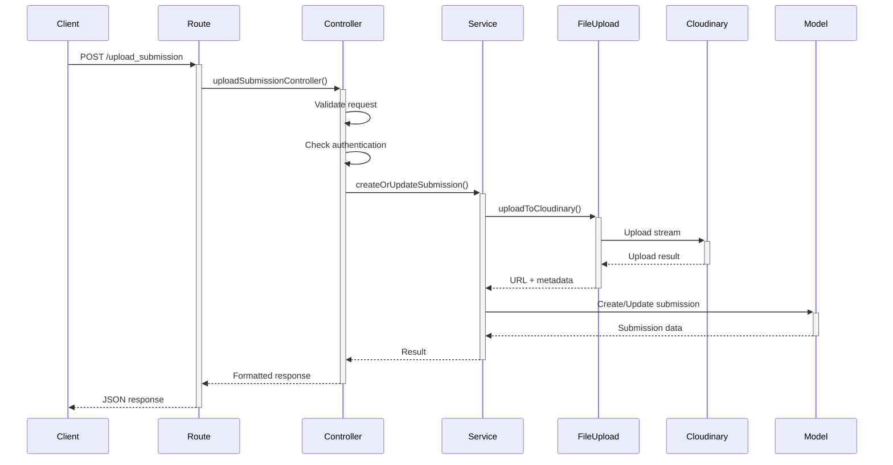

# File Upload Migration Summary

## Changes Made

### ✅ Migrated Cloudinary Upload to Backend

The file upload functionality has been completely migrated from frontend to backend following proper MVC architecture.

## New Architecture

### Created Files

1. **`backend/src/util/fileUpload.ts`** - Cloudinary utility functions
   - `uploadToCloudinary()` - Upload file stream to Cloudinary
   - `deleteFromCloudinary()` - Delete files from Cloudinary
   - `generateSignedUrl()` - Generate secure signed URLs

2. **`backend/src/services/submissionService.ts`** - Business logic layer
   - `createOrUpdateSubmission()` - Handle submission creation/update
   - `getSubmission()` - Retrieve single submission
   - `getSubmissionsByAssignment()` - Get all submissions for assignment

3. **`backend/src/controllers/submissionController.ts`** - Request handlers
   - `uploadSubmissionController()` - Handle upload requests
   - `getMySubmissionController()` - Handle get my submission requests
   - `getAssignmentSubmissionsController()` - Handle get all submissions requests

### Refactored Files

1. **`backend/src/routes/upload_submission.ts`**
   - Now delegates to controller (thin route layer)
   - Removed all business logic

2. **`backend/src/routes/get_submission.ts`**
   - Updated to use controllers
   - Maintained backward compatibility

## Architecture Benefits

### Separation of Concerns
```
Route → Controller → Service → Model/Util
```

- **Routes**: Define endpoints only
- **Controllers**: Handle HTTP requests/responses
- **Services**: Implement business logic
- **Utils**: Provide reusable helper functions

### Code Organization

**Before:**
```typescript
// All logic in route file (134 lines)
app.post('/upload_submission', async (req, resp) => {
  // Parse multipart
  // Validate
  // Authenticate
  // Upload to Cloudinary
  // Save to database
  // Format response
});
```

**After:**
```typescript
// Route (clean, 5 lines)
app.post('/upload_submission', async (req, resp) => {
  const getSession = (token) => app.session[token];
  await uploadSubmissionController(req, resp, getSession);
});

// Controller handles request/response
// Service handles business logic
// Util handles Cloudinary operations
```

## API Endpoints (No Changes)

All existing endpoints work exactly the same:

- **POST** `/upload_submission` - Upload a submission file
- **GET** `/my_submission/:assignmentID` - Get current user's submission
- **GET** `/submissions/:assignmentID` - Get all submissions for assignment
- **GET** `/submission/:id` - Get submission by ID

## Testing

### Build Status
✅ TypeScript compilation passes
✅ No lint errors in new files
✅ Backward compatible with existing frontend

### Run Tests
```bash
cd backend
pnpm run build      # Verify TypeScript compilation
pnpm run lint       # Check code quality
pnpm test          # Run test suite
```

## Environment Variables

Required for file upload (already configured):
```env
CLOUDINARY_CLOUD_NAME=dgs3xrimy
CLOUDINARY_API_KEY=225611285172258
CLOUDINARY_API_SECRET=rHOCsCgee1QqVoG_5dE1P1PKfoA
```

## File Upload Flow



## Next Steps

### Potential Improvements

1. **Add file validation**
   - File size limits
   - File type restrictions
   - Virus scanning

2. **Enhance error handling**
   - Custom error classes
   - Better error messages
   - Error logging service

3. **Add file management**
   - List uploaded files
   - Delete old submissions
   - File versioning

4. **Performance optimization**
   - Direct upload to Cloudinary (signed URLs)
   - Progress tracking
   - Chunked uploads for large files

5. **Security enhancements**
   - Rate limiting
   - File encryption
   - Signed URLs with expiration

## Documentation

See `backend/ARCHITECTURE.md` for detailed architecture documentation.

## Migration Complete! 🎉

The Cloudinary upload is now properly integrated in the backend following MVC principles. All functionality remains the same for the frontend, but the backend is now more maintainable, testable, and scalable.
